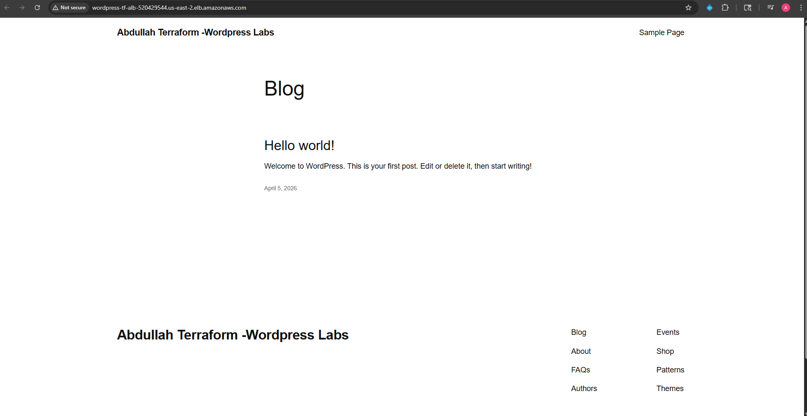
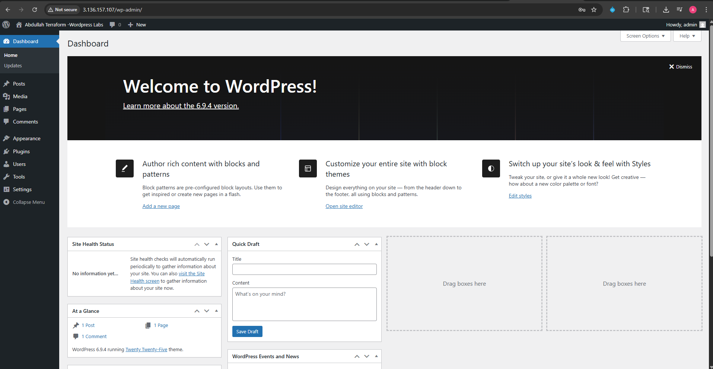

# WordPress on AWS — Terraform

Terraform project that provisions a production-style WordPress stack on AWS, fully automated via modular Terraform and cloud-init user data. Infrastructure mirrors my [ClickOps WordPress deployment](https://github.com/AbdullahHAbdi/clickops-aws-wordpress) — rebuilt as code.

---

## Architecture

```
Internet → CloudFront CDN → ALB (public subnets)
└── EC2 WordPress (private subnet)
└── RDS MySQL (private subnet)
└── S3 (media storage)

```
| Resource        | Details                                        |
|-----------------|------------------------------------------------|
| VPC             | Custom VPC, 2 public + 2 private subnets, 2 AZs|
| EC2             | t3.micro, Amazon Linux 2023, private subnet    |
| Web Server      | Apache + PHP 8.5 + php-fpm                     |
| Database        | RDS MySQL 8.4, private subnet                  |
| Load Balancer   | Application Load Balancer, public subnets      |
| CDN             | CloudFront with ALB + S3 origins               |
| Storage         | S3 bucket for media                            |
| IAM             | EC2 instance role with S3 + SSM access         |
| DNS             | Cloudflare (external)                          |

---

## Module Structure

```
modules/
├── vpc/              # VPC, subnets, IGW, NAT Gateway, route tables
├── security_groups/  # ALB, EC2, and RDS security groups
├── iam/              # EC2 instance role and instance profile
├── rds/              # RDS MySQL instance and subnet group
├── alb/              # Application Load Balancer, target group, listener
├── s3/               # Media storage bucket with versioning
├── ec2/              # EC2 instance, user data, ALB registration
└── cloudfront/       # CloudFront distribution with ALB + S3 origins

```
---

## Prerequisites

- [Terraform](https://developer.hashicorp.com/terraform/install) ≥ 1.3
- AWS CLI configured (`aws configure`)
- An existing EC2 key pair in your target region

---

## Quickstart
```bash
# 1. Clone the repo
git clone https://github.com/AbdullahHAbdi/wordpress-terraform
cd wordpress-terraform

# 2. Create your tfvars from the example
cp terraform.tfvars.example terraform.tfvars
# Fill in your key_name and db_password

# 3. Deploy
terraform init
terraform plan
terraform apply
```

After apply completes (~15 minutes for RDS and CloudFront):
```bash
terraform output wordpress_url
```

Open that URL in your browser to complete the WordPress setup wizard.

---

## Variables

| Variable          | Description                        | Default          |
|-------------------|------------------------------------|------------------|
| `aws_region`      | AWS region                         | `us-east-2`      |
| `project_name`    | Prefix for all resource names      | `wordpress-tf`   |
| `instance_type`   | EC2 instance type                  | `t3.micro`       |
| `ami_id`          | Amazon Linux 2023 AMI ID           | AL2023 us-east-2 |
| `key_name`        | Existing EC2 key pair name         | **required**     |
| `db_name`         | WordPress database name            | `wordpress`      |
| `db_username`     | RDS master username                | `wpuser`         |
| `db_password`     | RDS master password                | **required, sensitive** |

> `terraform.tfvars` is gitignored. See `terraform.tfvars.example` for the template.

---

## User Data

WordPress installation is handled by [`scripts/install_wordpress.sh`](scripts/install_wordpress.sh), injected into EC2 via Terraform's `templatefile()` function. The script:

- Updates system packages
- Installs Apache, PHP 8.5, and php-fpm
- Downloads and configures WordPress
- Connects WordPress to RDS using injected credentials
- Sets correct file ownership and permissions

Monitor install progress after launch:
```bash
# Via SSM Session Manager (AWS Console → Systems Manager → Session Manager)
sudo tail -f /var/log/wordpress-install.log
```

---

## Cleanup
```bash
terraform destroy
```

---

## Screenshots




---

## Related Projects

- [clickops-aws-wordpress](https://github.com/AbdullahHAbdi/clickops-aws-wordpress) — Same architecture deployed manually through the AWS Console, featuring VPC, public/private subnets, ALB, RDS, CloudFront, S3, and Cloudflare DNS